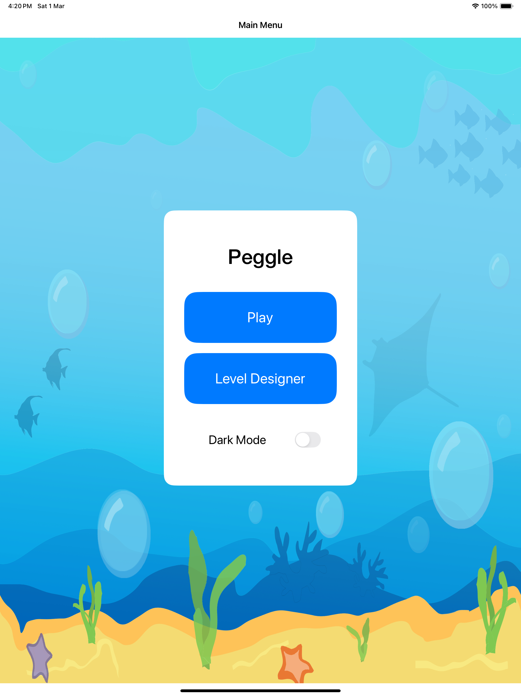
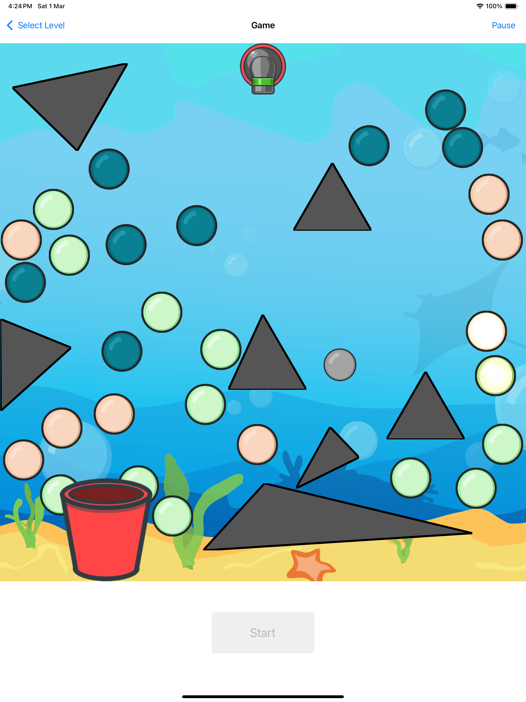
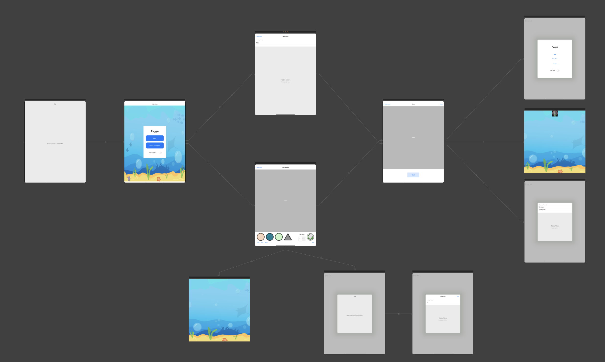
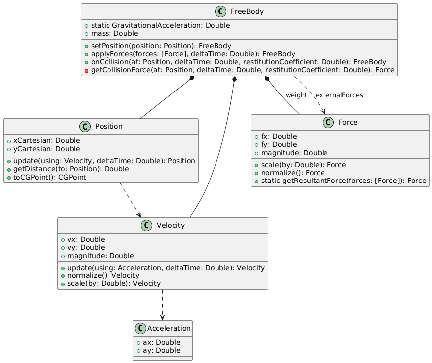

# README

## Glossary
- [Introduction](#introduction)
- [Design Layout](#design-layout)
- [Model Layer](#model-layer)
- [View Layer](#view-layer)
- [Controller Layer](#controller-layer)
- [Game Engine](#game-engine)
- [Physics Engine](#physics-engine)

## Introduction
Peggle primarily follows the Apple-style Model-View-Controller (MVC) architecture. The Controller layer assumes the responsibility of the middleman between the Model and View layers.

Peggle uses Storyboard and UIKit frameworks for the View and Controller layers. Core Data is used for data persistence.

**This game is primarily designed to be played on iPads.**

## Design Layout

The architecture for Peggle consists of 4 layers:
1. Model layer
- The model is an interface defining the data to be displayed or otherwise acted upon in the user interface.
- The model layer also contains query and mutation protocols which define how data is to be fetched from the persistence layer to the controller layer and vice versa.
2. View layer
- The view is a passive interface that displays data (the model) and routes user events to the controller to act upon that data.
3. Controller layer
- The controller acts upon the model and the view. It retrieves data from repositories (the model), and formats it for display in the view.
4. Persistence layer
- The persistence layer allows model data to persists its state by storing it outside the Peggle program.
- The persistence layer also contain implementations of query and mutation protocols defined by the model layer.

## Model layer
The models are implemented using `struct` and is immutable. To modify the model, you can use setter methods which return a new model containing the modified values.

Immutability ensures that the state of the models cannot be changed unexpectedly, which helps to prevent bugs and makes the code easier to reason about. It also allows for safer concurrent access to the models, as there is no risk of one part of the code modifying the model while another part is reading it.

Some attributes (e.g. relationship ID) for the models are optional.

### LevelQuery and LevelMutation
The `LevelQuery` and `LevelMutation` protocols define how the persistence layer would communicate with the controller layer regarding level data. Their implementation would be left up to the implementer to decide. This allows the persistence layer to be more modular as different implementations (e.g. Core Data or SQLite) can be swapped in without affecting the rest of the application.

The `LevelQuery` protocol include methods such as:
- `func fetch() -> [LevelModel]`
- `func fetchById(_ id: String) -> LevelModel?`

The `LevelMutation` protocol include methods such as:
- `func upsertLevel(_ level: LevelModel) -> LevelModel`
- `func deleteLevel(_ level: LevelModel)`

These protocols ensure that the controller layer can interact with the persistence layer in a consistent manner, regardless of the underlying implementation.

## View layer

Most views are managed using Storyboard designer.

### Level View
This is the main view of the level designer.

The main view consists of the following:
- Container view containing the board view. This is not the board view itself.
- Palette buttons to choose which peg to add. There is also a button to delete a peg when tapping any of them.
  - All palette buttons are unselected at the start.
  - Pressing any of the palette button would select it and unselect the rest.
  - Pressing a selected button would unselect it. The rest of the palette buttons remain unselected.
- Action button to load, save and reset the level designer.
  - Pressing the `LOAD` button would activate a segue to navigate to the level table view which would then appear as a modal. Users can select which level they would like to load.
  - Upon pressing `SAVE` button, a toast would appear at the bottom of the view if the save action is successful. Otherwise, an alert would be presented to indicate failure.

### Level Table View
The level table view is responsible for showing a list of levels which can be loaded. Only one level can be loaded at any single point in time.  At the top right corner, there is a `NEW` button for users to design a new level from scratch.
This view is presented to the user in the form of a modal.

Clicking on any of the level cells or the `NEW` button would close the modal and load in the chosen or new level in the main view.

### Board View
This view shows the pegs on the board. The background represented by an image view containing the background image. Pegs are then added programatically by the board view's controller.

## Controller Layer

There are 3 controllers for the level designer:
- `LevelViewController`
  - Manages the main view of the level designer
- `LevelTableViewController`
  - Manages the level table view
- `BoardViewController`
  - Manages the board view and placement of pegs

### State Management

*The above object diagram represents how state management is handled in the level designer*

#### Load Level

The `LevelTableViewController` object fetches a list of level models for the user to load. This is achieved by using its `LevelQuery` instance.

When the user selects a level to load in the level table view, the `LevelTableViewController` object informs the `loadLevelDelegate` about the selected level's id via a segue action. This `loadLevelDelegate` is the `LevelViewController` object.

Upon receiving the level id, the `LevelViewController` object retrieves the level model by using its own `LevelQuery`. This level model is then stored as an attribute named `currentLevel`.

#### Level Designer
To ensure state consistency between the `LevelViewController` and `BoardViewController`, the level state is stored in the LevelViewControlller.

We will then use the *delegate pattern* to designate the `LevelViewController` as a `LevelDesignerBoardDelegate` before passing it to `BoardViewController`'s contructor.

`BoardViewController` can then retrieve and modify the `currentLevel`'s `board` attribute by calling the delegate's methods.

The `BoardViewController` will not hold any state of the board model. By using the delegate pattern, we ensure that there is only a single source of truth about the level. This approach helps to achieve data consistency and synchronization across the two controllers.

## Game Engine
The Game Engine is a crucial component of the Peggle game and is responsible for managing the game state. It is part of the model layer in the Model-View-Controller (MVC) architecture.

### Overview
The `GameEngine` class is responsible for managing the game state.

### Key Components

#### GameEngine
The `GameEngine` class manages the overall game state and interactions. It includes methods for refreshing the game state and providing a snapshot of the current game state.

#### GameState
The `GameState` protocol represents a snapshot of the game state at a particular point in time. It includes the current ball, all pegs, and collided pegs.

#### Ball
The `Ball` struct represents a ball in the game. It is **immutable**.

#### Boundary
The `Boundary` struct represents the boundary of the game area. It includes properties for the width and height of the boundary and methods for checking if the ball is out of bounds.

#### PegModelable
The `PegModelable` protocol represents a peg model in the game. It includes properties for the peg's ID, board ID, radius, and center.

## Physics Engine

The Physics Engine is responsible for simulating the physical interactions in the game, such as movement and collisions. It is part of the model layer in the MVC architecture. The data types in the physics engine are **immutable**, meaning their state cannot be changed after they are created. Instead, new instances are created with the updated state.

### Physics Engine Class Diagram

### Key Components

#### FreeBody
The `FreeBody` struct represents a free body with mass, position, and velocity. It includes methods to apply forces, handle collisions, and calculate the collision force.

#### Position
The `Position` struct represents a position in Cartesian coordinates. It includes methods to update the position using velocity, calculate the distance to another position, and convert to `CGPoint`.

#### Velocity
The `Velocity` struct represents velocity with components `vx` and `vy`. It includes methods to update the velocity using acceleration, calculate the magnitude, normalize, and scale the velocity.

#### Acceleration
The `Acceleration` struct represents acceleration with components `ax` and `ay`.

#### Force
The `Force` struct represents a force with components `fx` and `fy`. It includes methods to calculate the magnitude, normalize, scale the force, and get the resultant force from a list of forces.
